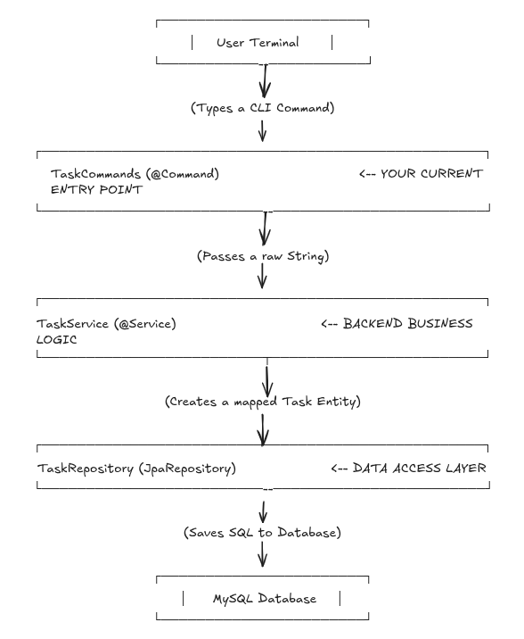

# Task Tracker
> This project is made to develop my spring boot skills. I am following a roadmap from the website called https://roadmap.sh. 
> In this project I have built simple command line interface (CLI) to track what you need to, what you have done, and what you are currently doing. 
> <b>THINGS I WILL LEARN:</b>  
> * Programming
> * Filesystem handling
> * How to build CLI application.

### Requirements
The user should be able to do the following:
* Add, Update, and Delete tasks
* Mark a task as in progress or done
* List all tasks
* List all tasks that are done
* List all tasks that are not done
* List all tasks that are in progress

https://roadmap.sh/projects/task-tracker